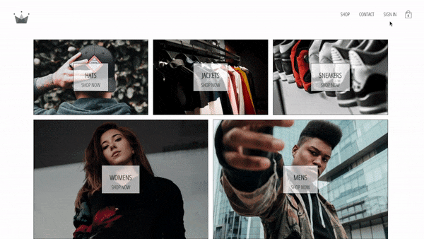

<h1 align="center"> CRWN Clothing 👑🛍 </h1>

A full stack <code>React.js</code>, <code>Redux</code> and <code>Firebase</code> e-commerce web app

Built with 💖 and ✨ by <a href='https://github.com/vannida-lim'>Vannida
Lim</a>

**See it live:** https://crwn-clothing-ecomm.herokuapp.com/
------------

**Demo**
------------

**Features**
------------

CRWN Clothing is an app that aims to provide users a convenient way to
shop for clothing items. Users can signup and login with their own or Google account. Users can add items to their cart and checkout with Stripe. 

**Tech Stack**
--------------

This web app makes use of the following:

**Backend**

-   [Firebase](https://firebase.google.com/)

**Front End**

-   [React.js](https://reactjs.org/) - Javascript library
-   [react-router](https://github.com/ReactTraining/react-router#readme) - NPM used for declarative routing
-   [react-redux](https://react-redux.js.org/) - React-Redux library
-   [styled-components](https://www.styled-components.com/) - CSS library

**Prerequisites**
-----------------

Before you begin, ensure you have installed the latest version of:

-   [Node.js and npm](https://nodejs.org/en/)

This web app uses the following API keys from:

-   [Google Firebase API](https://firebase.google.com/docs)

**Installing**
--------------

*For information on Backend Installation please click here: [Study Spots Backend](https://github.com/vannida-lim/studyspots-backend)*

Frontend Installation:

-   Clone this repo to your local machine `git clone git <this-repo-url>`

-   `cd` to `CRWN-clothing`

-   Ensure your Backend API is running at `http://localhost:3000/`
-   run npm install to install all dependencies

-   run `npm install && npm start` to run dependencies and start server

-   When prompted, ensure Frontend is running at `http://localhost:3001` or another available port 
